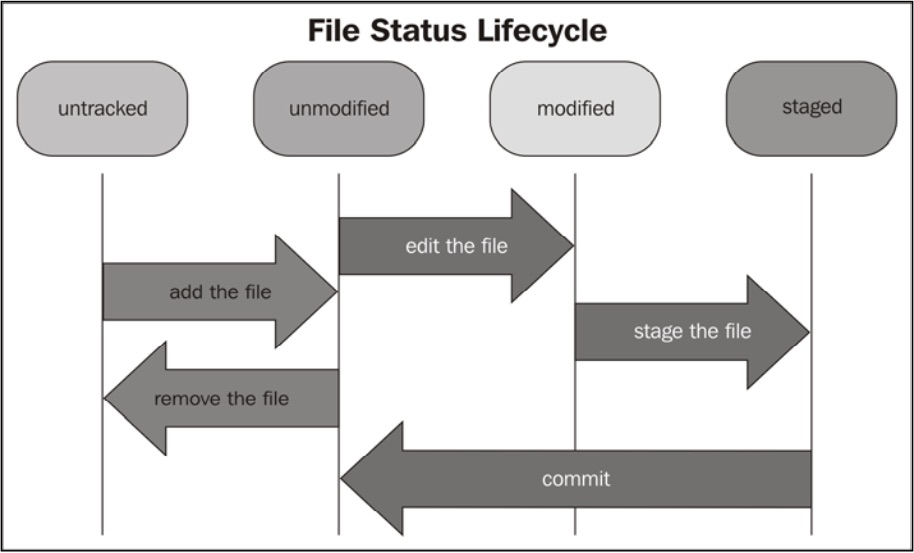
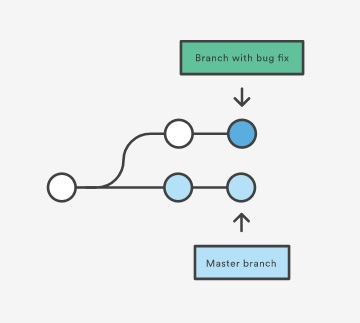
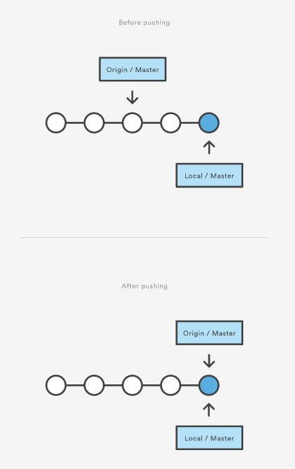

## Table of Contents

[Repository and Working Directory](#repository-and-working-directory)

  1. [Repository](#repository)
  2. [Working Directory](#working-directory)

[File Status Lifecycle](#file-status-lifecycle)

[Git Configuration](#git-configuration)

  1. [Configuration Architecture](#configuration-architecture)
  2. [Configuration Levels](#configuration-levels)
  3. [Ignoring some files and folders by default](#ignoring-some-files-and-folders-by-default)

[Branch](#branch)

[Common Commands](#common-commands)

[Reference Information](#reference-information)

<br />

## Repository and Working Directory

<a name="repository"></a>
Repository

 - A repository contains all the files for your project.

 - You may noticed that there is a _.git_ directory in the repository. Let's call it the git directory. In the git directory there are files and folders that compose our repository. Thanks to this, we can track the file status, configure the repository, and so on.

 - To be able to collaborate on any Git project, you need to know how to manage your remote repositories. Remote repositories are versions of your project that are hosted on the Internet or network somewhere.


**[⬆ back to top](#table-of-contents)**

<br />
<br />

<a name="working-directory"></a>
Working Directory

 - A folder that contains an initialized Git repository is a working directory.


**[⬆ back to top](#table-of-contents)**

<br />
<br />

## File Status Lifecycle



 - When you create or copy a new file in the working directory, the first state of the file is **untracked**.

 - If you want to include the file in your repository, you have to add it using the _add_ command. Once it is added, the state of the file becomes **unmodified**.

 - If you modify a file that is already added to the staging area, it changes its status to **modified**.

 - The staging area is a virtual place that collects all the files you want to include in the next commit. All the files (new or modified) you want to include in the next commit have to be **staged** using the _git add_ command.


 **[⬆ back to top](#table-of-contents)**

 <br />
 <br />

## Git Configuration

<a name="configuration-architecture"></a>
Configuration Architecture

 - The configuration options are stored in plain text files. The _git config_ command is just a convenient tool to edit these files without the hassle of remembering where they are stored and opening them in a text editor.


 **[⬆ back to top](#table-of-contents)**

 <br />
 <br />

<a name="configuration-levels"></a>
Configuration Levels

 - In Git we have three configuration levels which are：
    - System
    - User
    - Repository

 - There are different configuration files for every different configuration level.

 - You can basically set every parameter at every level according to your needs. If you set the same parameters at different levels, the lowest-level parameter hides the top level parameters.

    > System > User > Repository

    - System：every user and its repository will be affected.
      - `git config --system`
      - configuration file path：/usr/local/git/etc/gitconfig (Mac OS)

    - User：every user's repository will be affected.
      - `git config --global`
      - configuration file path：~/.gitconfig (Mac OS)

    - Repository：only the repository in use will be affected.
      - `git config --local`
      - configuration file path：~/<儲存庫所在的資料夾>/.git/config (Mac OS)


**[⬆ back to top](#table-of-contents)**

<br />
<br />

<a name="ignoring-some-files-and-folders-by-default"></a>
Ignoring some files and folders by default

 - We can create a _.gitignore_ file in the repository. Git will read it and then skip the  les and folders we listed inside it.

 > For the complete syntax of .gitignore see [Official Git Ignore Document](http://git-scm.com/docs/gitignore).


**[⬆ back to top](#table-of-contents)**

<br />
<br />

## Branch

 - A branch represents an independent line of development for your repository. Think of it as a brand-new working directory, staging area, and project history. Before you create any new branches, you automatically start out with the main branch (called master ).

 > For a visual example, this diagram shows the master branch and the other branch with a bug fix update.

 

 - **Origin** is the default upstream repository. Most projects have at least one upstream project which they track. By default _origin_ is used for that purpose.

 - **Master** is the default development branch. Whenever you create a Git repository, a branch named "master" is created, and becomes the active branch.

 > This diagram shows what happens when your local repository has changes that the central repository does not have and you push those changes to it.

 

 - When you want to share a branch with the world, you need to push it up to a remote that you have write access to. **_Your local branches aren’t automatically synchronized to the remotes_** you write to you have to explicitly push the branches you want to share.

 > That way, you can use private branches for work you don’t want to share, and push up only the topic branches you want to collaborate on.

 - Checking out a local branch from a remote-tracking branch automatically creates what is called a **"tracking branch"**. Tracking branches are local branches that have a direct relationship to a remote branch. If you’re on a tracking branch and type _git pull_, Git automatically knows which server to fetch from and branch to merge into.

**[⬆ back to top](#table-of-contents)**

<br />
<br />

## Common Commands

 - Create an empty Git repository or reinitialize an existing one.

   ```bash
   git init
   ```

 - Before fetching, remove any remote-tracking references that no longer exist on the remote.

   ```bash
   git fetch <remote repository name> --prune
   ```

   > Delete multiple obsolete tracking branches.

 - Download a branch from a remote repository, then immediately merges it into the current branch.

   ```bash
   git pull
   ```

   > Incorporates changes from a remote repository into the current branch. In its default mode, _git pull_ is shorthand for _git fetch_ followed by _git merge FETCH_\__HEAD_.

 - Upload local work to a configured remote location.

   ```bash
   git push
   ```

   > When you give the _git push_ command without specifying anything else, Git sends to the remote all the new commits you did locally in your actual branch. For new commits, we will send only the local commits that have not been uploaded yet.

 - Push the specified branch to _&lt;remote repository name&gt;_, along with all of the necessary commits and internal objects. This creates a local branch in the destination repository.

   ```bash
   git push <remote repository name> <branch name>
   ```

 - Using the _-u_ option, we told Git to track the remote branch. Tracking a remote branch is the way to tie your local branch with the remote one. When a local branch tracks a remote branch, you actually have a local and remote branch that can be kept easily in sync.

   ```bash
   git push -u <remote repository name> <branch name>
   ```

   > Note that this behavior is not automatic; you have to set it if you want it.

 - Moves changes from the working directory to the staging area.

   > This command can be performed multiple times before a commit.

   ```bash
   git add <file> || <directory>
   ```

 - Takes the staged snapshot with commit message and commits it to the project history.

   ```bash
   git commit -m '<commit message>'
   ```

 - Remove the specified file from the staging area, but leave the working directory unchanged.

   ```bash
   git reset <specified file name>
   ```

   > This unstages _a_ file without overwriting any changes.

 - Reset the staging area to match the most recent commit, but leave the working directory unchanged.

   ```bash
   git reset
   ```

   > This unstages _all_ files without overwriting any changes

 - Reset the staging area and the working directory to match the most recent commit. In addition to unstaging changes, the _--hard_ flag tells Git to overwrite all changes in the working directory, too.

   ```bash
   git reset --hard
   ```

 - Displays the state of the working directory and the staged snapshot.

   ```bash
   git status
   ```

 - List all of the branches in your repository.

   ```bash
   git branch
   ```

 - Create a new branch called _&lt;branch name&gt;_. This does not check out the new branch.

   ```bash
   git branch <branch name>
   ```

 - Rename the current branch to _&lt;branch name&gt;_.

   ```bash
   git branch -m <branch name>
   ```

 - Delete the specified branch. This is a **"safe"** operation in that Git prevents you from deleting the branch if it has unmerged changes.

   ```bash
   git branch -d <branch name>
   ```

 - Force delete the specified branch, even if it has unmerged changes.

   ```bash
   git branch -D <branch name>
   ```

 - Check out the specified branch, which should have already been created.

   ```bash
   git checkout <branch name>
   ```

 - Create and check out _&lt;branch name&gt;_. The _-b_ option is a convenience flag that tells Git to run _git branch &lt;branch name&gt;_ before running _git checkout &lt;branch name&gt;_.

   ```bash
   git checkout -b <branch name>
   ```

 - Merge the specified branch into the current branch.

   ```bash
   git merge <branch name>
   ```

 - Stashing takes your **_uncommitted changes_** (both staged and unstaged), saves them away for later use, and then reverts them from your working copy.

   ```bash
   git stash
   ```

   > At this point you're free to make changes, create new commits, switch branches, and perform any other Git operations; then come back and re-apply your stash when you're ready.

   > Note that the stash is local to your Git repository; stashes are not transferred to the server when you push.

   > By default Git won't stash changes made to untracked or ignored files.

 - Popping your stash removes the changes from your stash and reapplies them to your working copy.

   ```bash
   git stash pop
   ```

 - List the remote connections you have to other repositories.

   ```bash
   git remote
   ```

 - Create a new connection to a remote repository.

   ```bash
   git remote add <remote repository name> <remote repository url>
   ```

   > When you clone a repository with _git clone_, it automatically creates a remote connection called origin pointing back to the cloned repository.

 - Remove the connection to the remote repository.

   ```bash
   git remote rm <remote repository name>
   ```

**[⬆ back to top](#table-of-contents)**

<br />
<br />

## Reference Information

Git Essentials, Traditional Chinese (Author：Ferdinando Santacroce)

Getting Git Right (Website：[atlassian/git](https://www.atlassian.com/git))

Git Official Document (Website：[git official document](https://git-scm.com/docs))

cmatskas.com (Website：[Delete Git branch locally and remotely](https://cmatskas.com/delete-git-branch-locally-and-remotely/))

<br />
